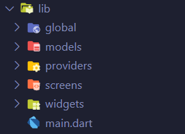

[](https://github.com/gadgetvala/dynamic_image_rendering)
[](https://github.com/gadgetvala/dynamic_image_rendering/issues)
[](https://www.linkedin.com/in/gadgetvala/)

# Introduction

> “Dynamic Image Rendering”
> is a small, simple example of image composition with flutter.

Before we start, you can take a look at the app:


## :bulb: Key Features

- [x] Different Parts of Images.
- [x] Dynamic States Conversion.
- [x] Sleek Design.
- [x] Null Safety.

## 🚀 &nbsp;Installation

To clone and run this application, you'll need [Git](https://git-scm.com) and [Flutter](https://flutter.dev/docs/get-started/install) installed on your computer. From your command line:

```bash
# Clone this repository
$ git clone https://github.com/gadgetvala/dynamic_image_rendering.git

# Go into the repository
$ cd dynamic_image_rendering

# Install dependencies
$ flutter packages get

# Run the app
$ flutter run
```

### Packages

Some very good packages are used in the project, not a big list.
Below are the information about these packages.

| package                                                                   | explain            |
| ------------------------------------------------------------------------- | ------------------ |
| [flutter_launcher_icons](https://pub.dev/packages/flutter_launcher_icons) | App Icon Generator |
| [flutter_switch](https://pub.dev/packages/flutter_switch)                 | Flutter Switch     |

### Directory Structure

The project directory structure is as follows:

```
├── android
├── build
├── images
├── ios
├── lib
├── pubspec.lock
├── pubspec.yaml

```

Let me explain the other directories besides **lib**:

| directory | explain                |
| --------- | ---------------------- |
| asset     | images for android app |

Then the lib directory



| directory | explain            |
| --------- | ------------------ |
| views     | Presentation Layer |
| main.dart | Main App Startup   |

## :clap: Done

Feel free to **file a new issue** with a respective title and description on the the [dynamic_image_rendering](https://github.com/gadgetvala/flutter_refresher_projects/issues) repository. If you already found a solution to your problem, **I would love to review your pull request**!

## 📘&nbsp; License

Free, Hell Yeah!!

## :heart: Contributor

Made by [Suraj Verma](https://github.com/gadgetvala)
